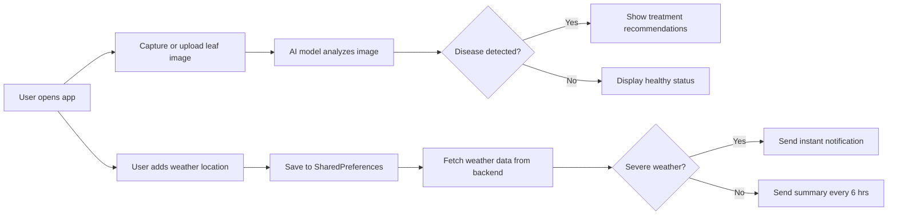

# 🌱 **AI-Powered Plant Disease Detection & Advisory System**

An end-to-end, mobile-friendly application designed to support farmers through:

* **AI-Based Disease Detection**: Capture or upload leaf images for instant diagnosis using a deep learning model.
* **Real-Time Treatment Recommendations**: Get personalized suggestions to manage and treat plant diseases.
* **Weather-Based Alerts**: Receive timely notifications about adverse weather conditions like storms, frost, or heatwaves.
* **News Updates**: A news prtal that displays latest news tailored to country and agriculture
* **Mobile-First Design**: Built using Flutter for a responsive and intuitive experience across Android, iOS, and Web.

---

## 🚀 Features

| **Feature**                     | **Description**                                               |
| ------------------------------- | ------------------------------------------------------------- |
| **Image Upload & Capture**      | Farmers can snap or upload leaf photos directly from the app. |
| **Deep Learning Diagnosis**     | Trained AI model classifies diseases like blight, rust, etc.  |
| **Treatment Guidance**          | Provides graphical and textual treatment recommendations.     |
| **Weather Monitoring & Alerts** | Users can track weather across multiple locations.            |
| **Automated Notifications**     | Sends alerts every 6 hours or instantly in severe weather.    |
| **Local Storage of Locations**  | Stores selected locations using SharedPreferences.            |
| **News & Advisory Feed**        | Displays the latest farming news using newsdata.io API.       |

---

## 📱 Mobile Deployment

Built with **Flutter**, supporting Android, iOS, and web platforms.

### Prerequisites

* Flutter SDK ≥ 3.0
* Android Studio (with emulator) or a physical device
* Backend APIs (Node.js for weather/news; Python for disease detection)

### Build & Run

```bash
# Fetch dependencies
flutter pub get

# Run on Android
flutter run -d android

# Or run as a web app
flutter run -d web-server
```

### Release APK

```bash
flutter build apk --release
```

---

## ⚙️ Architecture Overview



---

## 🔧 Backend Setup

### Run Node.js Server (for Weather & News APIs)

```bash
# From project root
cd .\backend\
node server.js
```

### Run Disease Detection Model (Python)

```bash
# From project root
cd '.\Disease Identification Model\'
python final.py
```

---

## 🛠️ Adding New Weather Locations

1. Tap **Add Weather Info** in the app.
2. Enter the city name or ZIP code.
3. A weather card appears; the data is saved locally.
4. Notifications are automatically managed for all saved locations.

---

## 🤝 Contributing

Contributions are welcome! Feel free to fork the repository, improve features, and open a pull request.


## Contributers

Diya Baweja (2203425)<br>
Gurjot Kaur (2203433)<br>
Rahul Sachdeva (2203536)
