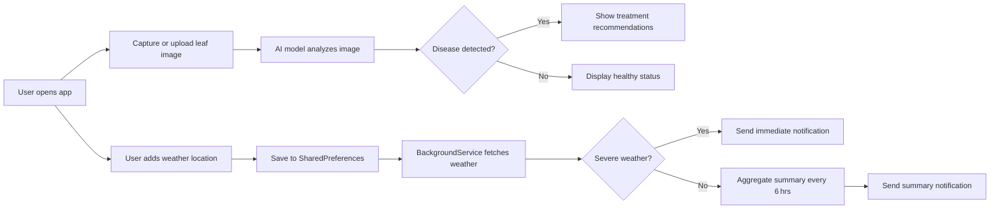

# AI-Powered Plant Disease Detection & Advisory System

An end-to-end mobile-friendly application that empowers farmers by:

- 🧠 **AI-Based Disease Detection**: Upload or capture leaf images for instant plant disease diagnosis.
- 💡 **Real-Time Treatment Recommendations**: Receive tailored guidance on managing and treating identified diseases.
- ⛅ **Weather & Location-Based Alerts**: Get timely warnings about adverse weather events (storms, frost, heatwaves) for your saved fields.
- 📱 **Mobile-First Design**: Intuitive Flutter app optimized for use on smartphones in the field.

---

## 🚀 Features

| Feature                                   | Description                                                 |
|-------------------------------------------|-------------------------------------------------------------|
| **Image Upload & Capture**                | Snap or select leaf photos directly in-app.                 |
| **Deep Learning Diagnosis**               | AI model classifies diseases (blight, rust, mildew, etc.).  |
| **Treatment Guidance**                    | Textual & graphical recommendations for disease management.|
| **Multi-Location Weather Cards**          | Add multiple farm locations; view current weather details.  |
| **Automated Weather Notifications**       | Scheduled (every 6 hrs) and instant severe-weather alerts.  |
| **Local Storage of Locations**            | Cities/fields stored via SharedPreferences for offline use. |
| **News & Advisory Feed**                  | Latest agricultural news from newsdata.io API.              |

---

## 📱 Mobile Deployment

This project uses **Flutter**, enabling cross-platform support for Android, iOS, and Web.

1. **Prerequisites**
   - Flutter SDK ≥ 3.0
   - Android Studio (with emulator) or physical device
   - Node.js backend for weather/news APIs (or public endpoints)

2. **Build & Run**
   ```bash
   # Fetch dependencies
   flutter pub get

   # Run on Android emulator or connected device
   flutter run -d android

   # Or serve as web app (test in browser)
   flutter run -d web-server
   ```

3. **Release APK**
   ```bash
   flutter build apk --release
   ```

---

## ⚙️ Architecture Overview



---

## 🔧 Setup Backend (Node.js example)

1. **Clone and install**
   ```bash
   git clone <repo-url>
   cd backend
   npm install
   ```
2. **Enable CORS** (in `server.js`)
   ```js
   const cors = require('cors');
   app.use(cors());
   ```
3. **Listen on all interfaces**
   ```js
   app.listen(3000, '0.0.0.0', () => console.log('Listening on 3000'));
   ```
4. **Run server**
   ```bash
   node server.js
   ```

---

## 🛠️ Adding New Weather Locations

1. Tap **Add Weather Info**.
2. Enter city name or ZIP code.
3. Weather card appears; data saved locally.
4. Notifications will cover all saved locations.

---

## 🤝 Contributing

Contributions are welcome! Please fork the repo and open a pull request with your improvements.

